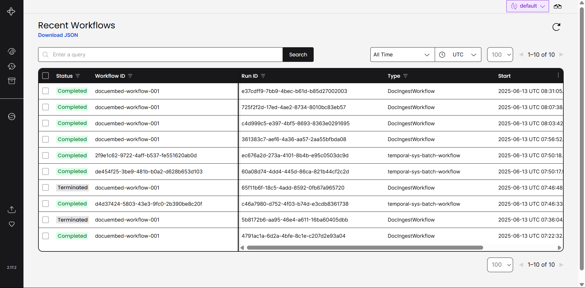
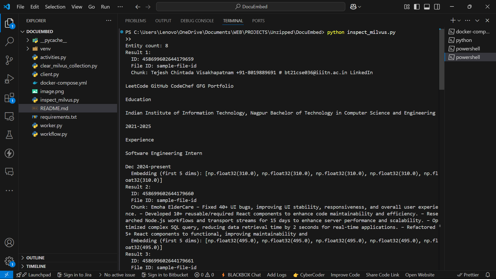

# DocuEmbed – Document Ingestion and Embedding Pipeline

## Overview

DocuEmbed is a document ingestion pipeline that:

- Fetches a document from a URL
- Parses it into content chunks using `unstructured`
- Generates embeddings using OpenAI
- Stores the data in a Milvus vector database
- Uses Temporal.io to orchestrate the workflow

---

## 1. Setup Instructions

### 1.1 Infrastructure (via Docker Compose)

Ensure Docker is installed, then run:

```bash
docker-compose up -d
```

---

This will start:

-> Temporal server

-> MySQL (Temporal DB)

-> Milvus

-> Etcd & MinIO (Milvus dependencies)

Ensure port 3306, 19530, 9091, and 7233 are free on your system.

### 1.2 Python Environment

Create a virtual environment and install the required packages:

```bash
python -m venv venv
source venv\Scripts\activate # for windows
pip install -r requirements.txt

```

## 2. Running the System

### 2.1 Start the Temporal Worker

The worker will execute the activities defined in the workflow:

```bash
python worker.py
```

### 2.2 Trigger the Workflow

Edit client.py and pass args:
{
file id,
url fr download,
file type
}

```bash
python client.py
```

## 3. Design Explanation

### 3.1 Workflow and Activities

DocIngestWorkflow: A Temporal workflow orchestrating the steps:

-> fetch_document: Uses aiohttp to download a document
-> parse_document: Uses unstructured to parse content
-> generate_embeddings: Instead of using OpenAI for generating embeddings,It creates fixed-size (10-dim) vectors where each value is the length of the corresponding chunk. This simplifies testing
and avoids dependency on external APIs or API keys. This logic can be easily swapped with a real embedding model later.
-> store_in_milvus: Stores vectors in Milvus

workflow.py => defines the workflow
activities.py => contains all the logic of activities
worker.py => initializes a worker
client.py => triggers the workflow
inspect_milvus.py => a helper script to inspect milvus data
clear_milvus_collection.py => a helper script to clear milvus data
requirements.txt => all requirements that neet to be installed
docker-compose.yml => for initializing all containers

### 3.2 Async Concurrency

-> Document fetching is asynchronous with aiohttp
-> Heavy parsing is offloaded using asyncio.to_thread

### 3.3 Error Handling and Retries

-> Workflow handles unsupported file types with validation
-> Errors are caught and converted to RuntimeError for clarity
-> Temporal automatically retries failed activities

### 3.4 Milvus Schema Design

The Milvus collection schema is designed to store chunked document data along with generated embeddings. It includes the following fields:

-> id: Auto-generated primary key (INT64, auto_id=True)
-> file_id: String identifier for the document (VARCHAR, max length 512)
-> chunk: The actual text chunk from the document (VARCHAR, max length 65535)
-> embedding: Vector embedding of the chunk (FLOAT_VECTOR, dimension = 10)

## 4. Assumptions

-> The file type is passed directly to the workflow
-> The file URL is publicly accessible (no authentication)
-> Milvus and Temporal run on the same network (via Docker)

## 5. Evidence of Success

-> Temporal Workflow Execution

-> Milvus Data Inserted

